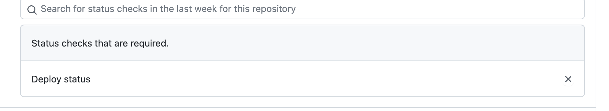
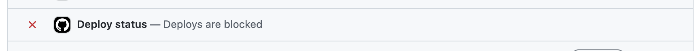

# Deploy status action

GitHub Action that blocks all deploys based upon an issue being raised with the "block deploys" label. If someone would
want to override the deploy, they would simply title their PR with "emergency deploy" label. This will unblock that
specific PR.

## Installation

1. Create a file called .github/workflows/deploy-status.yml in your repository with the following YAML (modify as
   instructed in the comments):

    ```yaml
    name: Deploy Status

   on:
     pull_request_target:
       branches:
         - master
       types: [opened, labeled, synchronize]
     issues:
       types: [labeled, closed]

   permissions:
     checks: read
     issues: read
     pull-requests: read
     statuses: write
   
   jobs:
     build:
       runs-on: ubuntu-latest
       steps:
         - uses: actions/checkout@v2
           with:
             repository: 'simplybusiness/deploy-status-action'
             ref: 'v2'
         - uses: ruby/setup-ruby@v1
           with:
             bundler-cache: true # runs 'bundle install' and caches installed gems automatically                       
         - name: Deploy Status Action
           uses: simplybusiness/deploy-status-action@v2
           env:
             CLIENT_ID: ${{ secrets.CLIENT_ID }}
             PRIVATE_KEY: ${{ secrets.PRIVATE_KEY }}
             AIRBRAKE_KEY: ${{ secrets.GH_AIRBRAKE_KEY }}
    ```
   **NOTE:** We recommend you use `pull_request_target` event as mentioned in example as it will work when you create
   PRs from a forked repository with provided permission. You can also use `pull_request` event but that will work only
   for the PR in same repository.

2. Create `block deploys` for blocking the deploy and `emergency deploy` labels which can be use for overriding the
   blocked deploys.

3. Add deploy status as required check in branch protection.

   

5. To block the deploy now open an issue with label `block deploys`. It will block all the deploys and show th status on
   PRs.

   

## Blocking the deployment pipeline

To manually block the deployment pipeline, raise a new issue in GitHub (re-opening an issue won't block the deployment
pipeline) with a title and add the label "block deploys". This will trigger an action within Github that will block all
PRs from merging to master. You will see a notification in all PRs that says: ``` Deploy status: Deploys are blocked ```
This will take around a minute to update the status of all PRs. If you need to deploy to staging to test first, block
the deployment pipeline, then wait until all other PRs have been deployed before you merge your PR in. If you don't do
this, your work will be bundled with other commits and things can get confusing!

## How to deploy a fix when the deployment pipeline is blocked

If you would need to deploy a fix while the deployment pipeline is blocked, you will need to add to your PR the "
emergency deploy" label. Once added, you will see in a minute or so, that the deployment pipeline is free for YOU only
and you will be able to merge. It is IMPORTANT to note that the "emergency deploy" label should only be added to a PR
that is fixing the issue that is causing is deployments to be blocked. It is never acceptable to add the "emergency
deploy" label to a PR that is not meant to address the underlying issue blocking the deployment pipeline.

## How to unblock the deployment pipeline

When you are ready to release the deployment pipeline, close the open issue in GitHub (do NOT remove the label). The
deployment pipeline will then be unblocked for all PRs in the repo. When the deployment pipeline is clear and you are
ready to merge, you will see this notification: ``` Deploy status - You are free to deploy ```
